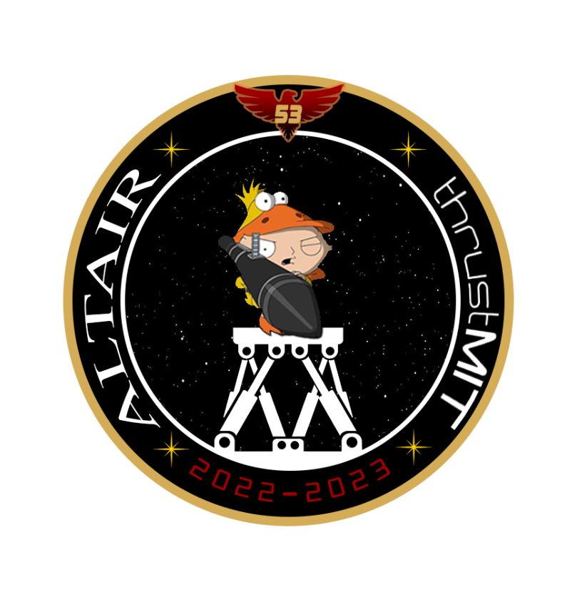

# Stewie-Robot
## Introduction

**Stewie** was a parallel manipulator robot which was developed as a non-deployable 4U Cubesat payload for a sounding rocket, "**Altair**" by thrustMIT which took part in the 2023 Spaceport America Cup in the United States. Altair was launched on June 23, 2023 in New Mexico, United States of America and it went to an apogee of almost 10,380 feet. 

## About Stewie
**Stewie** was named such so due to its inspiration from a real life stewart platform. It was a 3-DoF parallel manipulator robot whose objective was to demonstrate attitude control against the orientation change which the rocket undergoes along with the high vibrations and G-forces encountered by the rocket. The parallel manipulator mechansim was actuated by 3 separate servo motors wcih were controlled by a linear control system developed specially for the payload. 

|3D Model of Stewie|3D Render of Payload|
|:-:|:-:|
|||

|Test Setup of Stewie|Section View of CubeSat with Stewie|
|:-:|:-:|
|||

**Credits:-**
1. Utkarsh Anand
2. Diya Parekh
3. Thakur Pranav Gopal Singh
